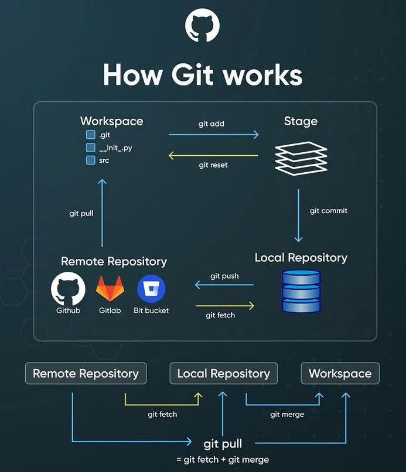

# Git y Github

[**<-- VOLVER AL INICIO**](/README.md)




## 1: Instalar Git localmente

Instalar Git en tu computadora.

Puedes descargarlo desde el [sitio oficial de Git](https://git-scm.com/) y seguir las [instrucciones de instalación](https://git-scm.com/book/es/v2/Inicio---Sobre-el-Control-de-Versiones-Instalaci%C3%B3n-de-Git) para tu sistema operativo.

**Tip:** _[Cómo instalar Git en Windows - Tutorial 2023](https://kinsta.com/es/base-de-conocimiento/instalar-git/)_

## 2: Configurar Git

Después de instalar Git, necesitas configurar tu nombre de usuario y tu dirección de correo electrónico. Abre tu terminal y ejecuta los siguientes comandos, sustituyendo "TuNombre" y "tu@email.com" con tus propias credenciales:

```bash
git config --global user.name "TuNombre"
git config --global user.email "Tu@Email.com"
```

**Tip:** _Puedes verificar tu configuración en cualquier momento ejecutando:_

```bash
git config --list
```

## 3: Crear un repositorio local

Abre tu terminal y navega al directorio donde deseas crear tu nuevo proyecto.

Ejecuta el siguiente comando para iniciar un nuevo repositorio Git:

`git init`

**Tip:** _Para acceder a un directorio utilizando la terminal Bash, puedes utilizar el comando cd (change directory). Aquí tienes un ejemplo básico:_

```bash
cd ruta/del/directorio
```

## 4: Agregar archivos al repositorio (stage)

Coloca tus archivos en el directorio del proyecto.

Usa el siguiente comando para añadir todos los archivos al área de preparación:

`git add .`

## 5: Realizar un commit

Después de agregar archivos, ejecuta el siguiente comando para realizar un commit:

`git commit -m "Mensaje descriptivo del commit"`

## 6: Crear un repositorio en GitHub

Visita GitHub e inicia sesión en tu cuenta.

Haz clic en el botón "+" en la esquina superior derecha y selecciona "New repository".

Dale un nombre a tu repositorio, añade una descripción opcional y haz clic en "Create repository".

## 7: Conectar el repositorio local con GitHub

En tu terminal, ejecuta el siguiente comando, sustituyendo nombreusuario y nuevorepositorio con tu nombre de usuario y el nombre del repositorio en GitHub:

```bash
git remote add origin https://github.com/nombreusuario/nuevorepositorio.git
```

Luego, sube tus cambios al repositorio remoto:

`git push -u origin main`

## Otras operaciones frecuentes

### Verificar el estado del repositorio local

Para ver el estado de tu repositorio local, ejecuta el siguiente comando:

```bash
git status
```

### Verificar el historial de commits

Para ver el historial de commits, ejecuta el siguiente comando:

```bash
git log
```

### Clonar un repositorio

Para clonar un repositorio existente, ejecuta el siguiente comando en tu terminal:

```bash
git clone direccion-del-repositorio-externo.git
```

El repositorio se clonará en tu directorio actual.

### Verificar el estado del repositorio remoto

Para ver el estado del repositorio remoto, ejecuta el siguiente comando:

Para verificar si hubo cambios en el repositorio remoto, puedes usar el comando `git fetch` seguido de git diff.

1. Ejecuta `git fetch origin` en la terminal. Esto traerá la información del repositorio remoto pero no hará ninguna modificación en tu repositorio local.

2. Ejecuta `git diff HEAD..origin/main` (o reemplaza `main` con el branch que estás siguiendo) para ver las diferencias entre tu último commit y el último commit en el repositorio remoto.

```bash
git fetch origin
git diff HEAD..origin/master
```

## Referencias

[Pro Git (Chacon & Straub) *online*](https://git-scm.com/book/es/v2)
